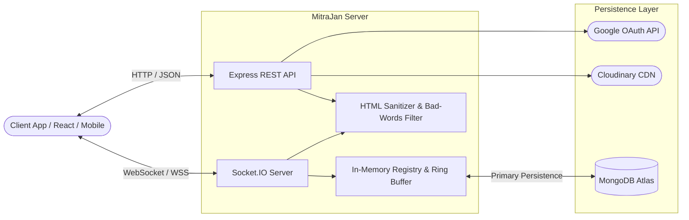
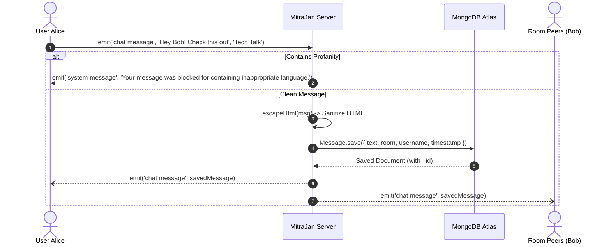
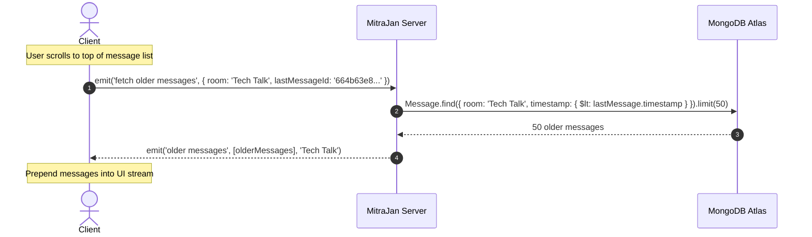
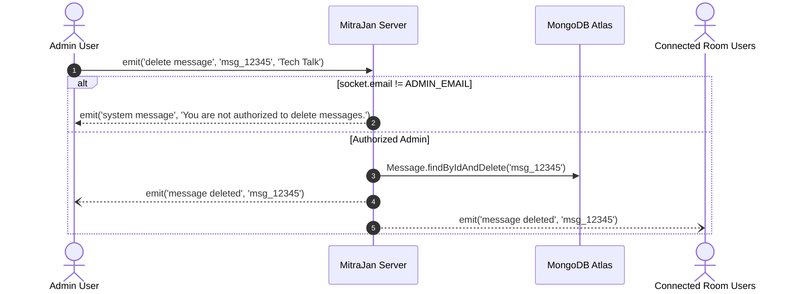

# 📡 MitraJan — API & WebSocket Event Specification

> **Comprehensive backend documentation for REST routes, Socket.IO event contracts, data schemas, and integration recipes.**  
> Designed for open-source contributors, frontend developers, and third-party client integrators.

---

## 📑 Table of Contents

- [📡 MitraJan — API \& WebSocket Event Specification](#-mitrajan--api--websocket-event-specification)
  - [📑 Table of Contents](#-table-of-contents)
  - [🌐 Overview \& Architecture](#-overview--architecture)
    - [Server Environments \& Ports](#server-environments--ports)
    - [Dual-Layer Storage Architecture](#dual-layer-storage-architecture)
    - [Global Headers \& Security](#global-headers--security)
  - [📦 Data Models \& Schemas](#-data-models--schemas)
    - [Message Schema](#message-schema)
    - [Room Schema](#room-schema)
    - [User Identity Model](#user-identity-model)
  - [🚀 REST API Reference](#-rest-api-reference)
    - [Authentication](#authentication)
      - [`POST /api/auth/google`](#post-apiauthgoogle)
        - [Request](#request)
        - [Responses](#responses)
        - [Example cURL](#example-curl)
    - [Rooms \& Statistics](#rooms--statistics)
      - [`GET /api/rooms`](#get-apirooms)
        - [Request](#request-1)
        - [Responses](#responses-1)
        - [Example cURL](#example-curl-1)
      - [`GET /api/rooms/:roomName/participants`](#get-apiroomsroomnameparticipants)
        - [Request](#request-2)
        - [Responses](#responses-2)
        - [Example cURL](#example-curl-2)
      - [`GET /api/rooms/:roomName/members`](#get-apiroomsroomnamemembers)
        - [Request](#request-3)
        - [Responses](#responses-3)
        - [Example cURL](#example-curl-3)
    - [Media \& Assets](#media--assets)
      - [`GET /api/folder-songs`](#get-apifolder-songs)
        - [Request](#request-4)
        - [Responses](#responses-4)
        - [Example cURL](#example-curl-4)
  - [⚡ Socket.IO Real-Time Event Contracts](#-socketio-real-time-event-contracts)
    - [Connection \& Handshake](#connection--handshake)
    - [Event Summary Matrix](#event-summary-matrix)
    - [Event Naming \& Legacy Alias Guide](#event-naming--legacy-alias-guide)
    - [Client-to-Server (C2S) Events](#client-to-server-c2s-events)
      - [1. `set username`](#1-set-username)
      - [2. `join room`](#2-join-room)
        - [Server Side Actions:](#server-side-actions)
      - [3. `chat message`](#3-chat-message)
        - [Server Side Actions:](#server-side-actions-1)
      - [4. `typing`](#4-typing)
      - [5. `fetch older messages`](#5-fetch-older-messages)
      - [6. `leave room`](#6-leave-room)
        - [Server Side Actions:](#server-side-actions-2)
      - [7. `delete message`](#7-delete-message)
        - [Server Side Responses:](#server-side-responses)
    - [Server-to-Client (S2C) Events](#server-to-client-s2c-events)
      - [1. `chat message` (Broadcast)](#1-chat-message-broadcast)
      - [2. `system message`](#2-system-message)
      - [3. `chat history`](#3-chat-history)
      - [4. `older messages`](#4-older-messages)
      - [5. `typing` (Broadcast)](#5-typing-broadcast)
      - [6. `rooms updated`](#6-rooms-updated)
      - [7. `message deleted`](#7-message-deleted)
    - [Socket.IO Lifecycle Events](#socketio-lifecycle-events)
      - [1. `disconnect`](#1-disconnect)
  - [🔄 Real-Time Sequence Workflows](#-real-time-sequence-workflows)
    - [1. User Connection \& Room Joining](#1-user-connection--room-joining)
    - [2. Sending Messages \& Profanity Filtering](#2-sending-messages--profanity-filtering)
    - [3. Pagination / Fetching Older Messages](#3-pagination--fetching-older-messages)
    - [4. Admin Message Deletion](#4-admin-message-deletion)
  - [💻 Quickstart Client Integration Example](#-quickstart-client-integration-example)
  - [🛠️ Contributing \& Support](#️-contributing--support)

---

## 🌐 Overview & Architecture

MitraJan provides a unified real-time communications engine built on **Express.js** and **Socket.IO (v4)**, backed by **MongoDB Atlas** with automatic in-memory fallback mechanisms.



### Server Environments & Ports

| Property | Default Value | Environment Variable | Notes |
| :--- | :--- | :--- | :--- |
| **HTTP Base URL** | `http://localhost:3000` | `PORT` | Set in `.env` (defaults to `3000`) |
| **WebSocket URL** | `http://localhost:3000` | `PORT` | Uses the same port as HTTP server |
| **Socket.IO Path** | `/socket.io/` | Built-in default | Default Socket.IO client path |
| **CORS Origin** | `*` (Any origin in dev) | `CORS_ORIGIN` | Set to specific client domain in production |

### Dual-Layer Storage Architecture

> [!NOTE]
> **Resilience Guarantee**: If MongoDB (`MONGO_URI`) is unreachable or not configured, the backend automatically transitions to an in-memory ring-buffer store (`roomRegistry` and `roomMessages`). 
> - Default rooms are automatically seeded.
> - Up to 250 recent messages per room are preserved in memory during session runtime.
> - Reconnection to MongoDB is periodically attempted in the background.

### Global Headers & Security

All REST responses include the following security and CORS configurations:
- `Cross-Origin-Opener-Policy: same-origin-allow-popups` (Required for Google Identity OAuth popup flows)
- `Access-Control-Allow-Origin: *` (REST API allows all origins by default; `CORS_ORIGIN` env variable configures Socket.IO)
- Automatic HTML escaping via `escapeHtml()` on incoming chat messages to eliminate Cross-Site Scripting (XSS).
- Profanity filtering via `bad-words` dictionary on message bodies and room names.

---

## 📦 Data Models & Schemas

### Message Schema

Mongoose Model: `Message` (`server/models/Message.js`)

| Field | Type | Required (DB) | Default (DB) | Description |
| :--- | :--- | :---: | :--- | :--- |
| `_id` | `ObjectId` (MongoDB) / `string` (in-memory) | Yes | Auto-generated | Unique identifier for the message |
| `username` | `String` | No | — | Display name of author (server assigns `'Anonymous'` when unset) |
| `email` | `String` | No | — | Author email (from Google OAuth or guest session) |
| `picture` | `String` | No | — | Avatar image URL |
| `text` | `String` | No | — | Message body (server rejects empty/whitespace-only messages) |
| `room` | `String` | No | — | Target room name (server rejects missing room) |
| `timestamp` | `Date` / `ISO 8601` | No | `Date.now` | Creation timestamp |

```json
{
  "_id": "664b63e8a4521f52d43e8a11",
  "username": "Kshitij Nangare",
  "email": "kshitijnangare@example.com",
  "picture": "https://lh3.googleusercontent.com/a/ACg8ocI4w...",
  "text": "Hello world! Welcome to MitraJan.",
  "room": "Tech Talk",
  "timestamp": "2026-09-05T00:50:00.000Z"
}
```

### Room Schema

Mongoose Model: `Room` (`server/models/Room.js`)

| Field | Type | Required | Unique | Description |
| :--- | :--- | :--- | :--- | :--- |
| `_id` | `ObjectId` | Yes | Yes | Unique room identifier |
| `name` | `String` | Yes | Yes | Room identifier & display name (e.g., `"Tech Talk"`) |
| `desc` | `String` | No | No | Short description of topic/purpose |
| `icon` | `String` | No | No | Emoji or icon representative (e.g., `"💻"`) |

> [!WARNING]
> **Cascading Cleanup Middleware**: When a room is deleted via `Room.findOneAndDelete()`, Mongoose middleware automatically purges all messages belonging to `room.name` and emits a server-wide `roomDeleted` event.

### User Identity Model

Users identify themselves either as guest profiles or authenticated Google OAuth users:

```typescript
interface UserProfile {
  name: string;        // Full display name
  email?: string;      // Optional email address (guest sessions send an empty string)
  picture?: string;    // Avatar URL
}
```

---

## 🚀 REST API Reference

### Authentication

---

#### `POST /api/auth/google`

Verifies a Google OAuth 2.0 ID token issued by the client-side Google Sign-In SDK.

##### Request

- **Method**: `POST`
- **Path**: `/api/auth/google`
- **Headers**:
  - `Content-Type: application/json`
- **Body**:

| Field | Type | Required | Description |
| :--- | :--- | :--- | :--- |
| `token` | `string` | **Yes** | Google ID Token (JWT) obtained from client-side Google Identity Services |

```json
{
  "token": "eyJhbGciOiJSUzI1NiIsImtpZCI6IjY2ZGU..."
}
```

##### Responses

- **`200 OK`**: Token verified successfully.

```json
{
  "success": true,
  "user": {
    "name": "Alex Mercer",
    "email": "alex.mercer@gmail.com",
    "picture": "https://lh3.googleusercontent.com/a/ACg8ocK..."
  }
}
```

- **`401 Unauthorized`**: Token invalid, expired, or audience mismatch.

```json
{
  "success": false,
  "message": "Invalid Google token"
}
```

##### Example cURL

```bash
curl -X POST http://localhost:3000/api/auth/google \
  -H "Content-Type: application/json" \
  -d '{"token": "<GOOGLE_ID_TOKEN>"}'
```

---

### Rooms & Statistics

---

#### `GET /api/rooms`

Retrieves all available chat rooms along with aggregated metrics (total messages and historical count of unique message authors). Rooms are sorted descending by activity (`totalMessages`).

##### Request

- **Method**: `GET`
- **Path**: `/api/rooms`
- **Query Parameters**: None

##### Responses

- **`200 OK`**:

```json
[
  {
    "name": "Tech Talk",
    "desc": "Discuss latest tech trends, programming, gadgets.",
    "icon": "💻",
    "memberCount": 18,
    "totalMessages": 342
  },
  {
    "name": "Gaming Lair",
    "desc": "Community for gamers, share tips, find teammates.",
    "icon": "🎮",
    "memberCount": 9,
    "totalMessages": 115
  },
  {
    "name": "Open Discussions",
    "desc": "General chat for everyone on various topics.",
    "icon": "🗣️",
    "memberCount": 5,
    "totalMessages": 42
  }
]
```

##### Example cURL

```bash
curl -X GET http://localhost:3000/api/rooms
```

---

#### `GET /api/rooms/:roomName/participants`

Returns the currently **active online participants** connected to the specified room through live WebSockets.

##### Request

- **Method**: `GET`
- **Path**: `/api/rooms/:roomName/participants`
- **Path Parameters**:

| Parameter | Type | Required | Description |
| :--- | :--- | :--- | :--- |
| `roomName` | `string` | **Yes** | URL-encoded name of the room (e.g., `Tech%20Talk`) |

##### Responses

- **`200 OK`**: Returns unique list of active socket participants.

```json
[
  {
    "username": "Alex Mercer",
    "picture": "https://lh3.googleusercontent.com/a/ACg8ocK..."
  },
  {
    "username": "DevGuru",
    "picture": null
  }
]
```

> [!NOTE]
> If no users are currently connected or the room does not exist in active socket memory, this returns an empty list `[]`.

##### Example cURL

```bash
curl -X GET "http://localhost:3000/api/rooms/Tech%20Talk/participants"
```

---

#### `GET /api/rooms/:roomName/members`

Returns all **historical members** who have posted messages in the specified room, deduplicated by user email or username.

##### Request

- **Method**: `GET`
- **Path**: `/api/rooms/:roomName/members`
- **Path Parameters**:

| Parameter | Type | Required | Description |
| :--- | :--- | :--- | :--- |
| `roomName` | `string` | **Yes** | URL-encoded name of the room |

##### Responses

- **`200 OK`**: Array of member profiles (alphabetically sorted when connected to MongoDB; unsorted in in-memory fallback mode).

```json
[
  {
    "username": "Alex Mercer",
    "email": "alex.mercer@gmail.com",
    "picture": "https://lh3.googleusercontent.com/a/ACg8ocK..."
  },
  {
    "username": "Guest_904",
    "email": "",
    "picture": null
  }
]
```

##### Example cURL

```bash
curl -X GET "http://localhost:3000/api/rooms/Tech%20Talk/members"
```

---

### Media & Assets

---

#### `GET /api/folder-songs`

Returns a list of streaming audio URLs for the in-app background music player. If Cloudinary credentials are configured, it searches the Cloudinary folder; otherwise, it returns a curated default playlist.

##### Request

- **Method**: `GET`
- **Path**: `/api/folder-songs`
- **Query Parameters**: None

##### Responses

- **`200 OK`**: Array of audio stream URLs (`.mp3`, `.wav`, `.m4a`, `.ogg`, `.aac`, `.mp4`).

```json
[
  "https://res.cloudinary.com/dhet30juy/video/upload/v1784979770/Vaari_Jaavan_Psytrance_Mix_lcf4g8.mp3",
  "https://res.cloudinary.com/dhet30juy/video/upload/v1784979767/Rang_De_Lal_Oye_Oye_Bollytech_Mashup_fcionh.mp3",
  "https://res.cloudinary.com/dhet30juy/video/upload/v1784979751/The_OTC_Roman_Reigns_makes_his_entrance_at_WrestleMania_42.mp3"
]
```

##### Example cURL

```bash
curl -X GET http://localhost:3000/api/folder-songs
```

---

## ⚡ Socket.IO Real-Time Event Contracts

MitraJan utilizes **Socket.IO** for bi-directional event-driven messaging.

### Connection & Handshake

```javascript
import { io } from "socket.io-client";

const socket = io("http://localhost:3000", {
  transports: ["websocket", "polling"],
  reconnection: true,
  reconnectionAttempts: 5,
  reconnectionDelay: 1000
});
```

---

### Event Summary Matrix

| Event Name | Direction | Payload Type | Description |
| :--- | :---: | :--- | :--- |
| [`set username`](#1-set-username) | **C2S** | `(name, room?, email?, picture?)` | Registers user identity and profile metadata on socket |
| [`join room`](#2-join-room) | **C2S** | `(roomName: string)` | Joins chat room channel, seeds room if new, receives history |
| [`chat message`](#3-chat-message) | **C2S** | `(messageText: string, roomName: string)` | Sends message for profanity screening, persistence, and broadcast |
| [`typing`](#4-typing) | **C2S** | `{ room: string, username: string }` | Sends typing activity indicator |
| [`fetch older messages`](#5-fetch-older-messages) | **C2S** | `{ room: string, lastMessageId: string }` | Requests paginated batch of prior messages |
| [`leave room`](#6-leave-room) | **C2S** | `(roomName: string)` | Leaves socket room channel and alerts room peers |
| [`delete message`](#7-delete-message) | **C2S** | `(messageId: string, roomName: string)` | Removes message (Requires `ADMIN_EMAIL` authorization) |
| [`disconnect`](#socketio-lifecycle-events) | **Lifecycle** | None | Fired when connection drops or tab closes |
| [`chat message`](#1-chat-message-broadcast) | **S2C** | `MessageObject` | Broadcast of sanitized and persisted message to room peers |
| [`system message`](#2-system-message) | **S2C** | `string` | System notices (user joined, user left, warnings, errors) |
| [`chat history`](#3-chat-history) | **S2C** | `(messages: MessageObject[], room: string)` | Emits up to 50 recent messages upon room entry |
| [`older messages`](#4-older-messages) | **S2C** | `(messages: MessageObject[], room: string)` | Emits requested historical messages for pagination |
| [`typing`](#5-typing-broadcast) | **S2C** | `string (username)` | Alerts peers that a specific user is typing |
| [`rooms updated`](#6-rooms-updated) | **S2C** | None | Alerts all clients to re-fetch room list & live stats |
| [`message deleted`](#7-message-deleted) | **S2C** | `string (messageId)` | Instructs room clients to remove message from UI |

---

### Event Naming & Legacy Alias Guide

> [!TIP]
> **Contributor Reference**: In some documentation discussions or legacy prototypes (`legacy-index.js`), snake_case names were referenced. Here is the exact mapping between the active canonical events and common aliases:

| Canonical Active Event (Current Server) | Common Issue / Alias Mention | Direction | Notes |
| :--- | :--- | :---: | :--- |
| `join room` | `join_room` | C2S | Active implementation uses space separator `"join room"` |
| `chat message` | `send_message` / `receive_message` | C2S / S2C | Current server uses `"chat message"` for emit and broadcast |
| `typing` | `typing` | Both | Identical across all implementations |
| `disconnect` | `user_disconnected` | Lifecycle | Handled via standard Socket.IO `"disconnect"` hook |
| `leave room` | `leave_room` | C2S | Active implementation uses space separator `"leave room"` |

---

### Client-to-Server (C2S) Events

#### 1. `set username`

Binds display information and authentication credentials to the current socket session.

- **Trigger**: Upon client connection or following Google Sign-In.
- **Parameters**:

| Param | Type | Required | Default | Description |
| :--- | :--- | :---: | :--- | :--- |
| `name` | `string` | **Yes** | `'Anonymous'` | User display name |
 | `room` | `string` | No | — | Currently ignored by the server (reserved/legacy positional param) |
 | `email` | `string` | No | — | User email address (used for admin validation & avatar mapping) |
 | `picture` | `string` | No | — | Avatar image URL |

```javascript
// Client Example
socket.emit('set username', 'Alex Mercer', 'Tech Talk', 'alex@gmail.com', 'https://lh3.google.../avatar.jpg');
```

---

#### 2. `join room`

Joins a chat room. Triggers room existence verification, profanity checking on the room name, joins the Socket.IO channel, and triggers initial message history delivery.

- **Trigger**: User opens or switches into a room.
- **Parameters**: `(room: string)`

```javascript
// Client Example
socket.emit('join room', 'Tech Talk');
```

##### Server Side Actions:
1. Trims and normalizes room name.
2. Checks profanity: if forbidden, sends `system message` ("This room name is not allowed...").
3. Automatically seeds custom room in registry/DB if not present.
4. Executes `socket.join(normalizedRoom)`.
5. Broadcasts to room: `system message` ("<username> has joined the room.").
6. Broadcasts to all clients: `rooms updated`.
7. Sends recent 50 messages to joining socket via `chat history`.

---

#### 3. `chat message`

Submits a new chat message to a room.

- **Trigger**: User hits send in chat input.
- **Parameters**: `(msg: string, room: string)`

```javascript
// Client Example
socket.emit('chat message', 'Hello everyone!', 'Tech Talk');
```

##### Server Side Actions:
1. Ignores empty or whitespace-only messages.
2. Performs profanity filtering (checks alphanumeric character sequence against bad-words dictionary). If rejected, emits `system message` only to sender.
3. Sanitizes HTML characters (`<`, `>`, `&`, `"`, `'`) to mitigate XSS attacks.
4. Persists message to MongoDB (or in-memory ring buffer).
5. Broadcasts persisted object via `chat message` to all sockets in the room (`io.to(room)`).

---

#### 4. `typing`

Sends typing indicator to notify other room members that the user is composing a message.

- **Trigger**: Keyboard input in chat textarea.
- **Parameters**: `{ room: string, username: string }`

```javascript
// Client Example
socket.emit('typing', {
  room: 'Tech Talk',
  username: 'Alex Mercer'
});
```

---

#### 5. `fetch older messages`

Requests prior messages earlier than a given message timestamp for infinite scroll pagination.

- **Trigger**: User scrolls to top of chat message stream.
- **Parameters**: `{ room: string, lastMessageId: string }`

```javascript
// Client Example
socket.emit('fetch older messages', {
  room: 'Tech Talk',
  lastMessageId: '664b63e8a4521f52d43e8a11'
});
```

---

#### 6. `leave room`

Leaves an active chat room channel.

- **Trigger**: User leaves chat screen or switches room.
- **Parameters**: `(room: string)`

```javascript
// Client Example
socket.emit('leave room', 'Tech Talk');
```

##### Server Side Actions:
1. Calls `socket.leave(room)`.
2. Broadcasts `system message` ("<username> has left the room.") to remaining room members.

---

#### 7. `delete message`

Deletes a message by its ID. Only permitted for authorized administrators.

- **Trigger**: Admin clicks delete icon on message.
- **Parameters**: `(messageId: string, room: string)`
- **Authorization**: `socket.email === ADMIN_EMAIL` (default: `harshbajpai1194@gmail.com`).

```javascript
// Client Example
socket.emit('delete message', '664b63e8a4521f52d43e8a11', 'Tech Talk');
```

##### Server Side Responses:
- If unauthorized: emits `system message` ("You are not authorized to delete messages.").
- If authorized: deletes from database/memory and broadcasts `message deleted` event to all users in the room.

---

### Server-to-Client (S2C) Events

#### 1. `chat message` (Broadcast)

Fired to all clients in a room when a new message is successfully validated and stored.

- **Payload**: `MessageObject`

```json
{
  "_id": "664b63e8a4521f52d43e8a11",
  "username": "Alex Mercer",
  "email": "alex.mercer@gmail.com",
  "picture": "https://lh3.googleusercontent.com/a/ACg8ocK...",
  "text": "Check out this PR!",
  "room": "Tech Talk",
  "timestamp": "2026-09-05T00:52:10.123Z"
}
```

```javascript
// Client Handler
socket.on('chat message', (message) => {
  console.log(`[${message.room}] ${message.username}: ${message.text}`);
});
```

---

#### 2. `system message`

Emitted for informational notifications, moderation alerts, or errors.

- **Payload**: `string`

```javascript
// Client Handler
socket.on('system message', (notice) => {
  // Examples:
  // "Alex Mercer has joined the room."
  // "Your message was blocked for containing inappropriate language."
  // "You are not authorized to delete messages."
  showToast(notice);
});
```

---

#### 3. `chat history`

Emitted directly to a user upon entering a room. Contains the most recent 50 messages in chronological order.

- **Payload**: `(messages: MessageObject[], room: string)`

```javascript
// Client Handler
socket.on('chat history', (messages, room) => {
  console.log(`Loaded ${messages.length} messages for room ${room}`);
  setMessages(messages);
});
```

---

#### 4. `older messages`

Emitted in response to `fetch older messages`. Contains up to 50 older messages preceding `lastMessageId`.

- **Payload**: `(messages: MessageObject[], room: string)`

```javascript
// Client Handler
socket.on('older messages', (olderMsgs, room) => {
  prependMessages(olderMsgs);
});
```

---

#### 5. `typing` (Broadcast)

Broadcast to room peers (excluding sender) when a user is typing.

- **Payload**: `string (username)`

```javascript
// Client Handler
socket.on('typing', (username) => {
  setTypingUser(`${username} is typing...`);
});
```

---

#### 6. `rooms updated`

Broadcast to all connected clients when a new room is created or a user joins, signaling clients to refresh room stats.

- **Payload**: None.

```javascript
// Client Handler
socket.on('rooms updated', () => {
  fetchRooms(); // Calls GET /api/rooms
});
```

---

#### 7. `message deleted`

Broadcast to all clients in a room when a message has been removed by an admin.

- **Payload**: `string (messageId)`

```javascript
// Client Handler
socket.on('message deleted', (deletedMessageId) => {
  setMessages(prev => prev.filter(msg => msg._id !== deletedMessageId));
});
```

---
### Socket.IO Lifecycle Events

#### 1. `disconnect`

Standard Socket.IO lifecycle event fired automatically on both client and server when network connection drops, tab closes, or `socket.disconnect()` is called.

- **Trigger**: Connection drop, tab close, or explicit disconnect.
- **Server Side**: Logs user disconnection, leaves rooms, and cleans up socket resources.

---

## 🔄 Real-Time Sequence Workflows

### 1. User Connection & Room Joining

```mermaid
sequenceDiagram
    autonumber
    actor User as Client (Browser)
    participant Srv as MitraJan Server
    participant DB as MongoDB Atlas

    User->>Srv: Connect WebSocket (http://localhost:3000)
    Srv-->>User: Connection Established (socket.id)
    User->>Srv: emit('set username', 'Alex', 'Tech Talk', 'alex@gmail.com')
    User->>Srv: emit('join room', 'Tech Talk')
    
    rect rgb(20, 30, 45)
        Note over Srv,DB: Verify & Seed Room
        Srv->>DB: Room.findOneAndUpdate({ name: 'Tech Talk' }, upsert=true)
        Srv->>Srv: socket.join('Tech Talk')
    end
    
    Srv-->>User: emit('chat history', [last 50 messages], 'Tech Talk')
    Srv--)User: broadcast to 'Tech Talk' emit('system message', 'Alex has joined the room.')
    Srv--)User: broadcast to ALL emit('rooms updated')
```



---

### 2. Sending Messages & Profanity Filtering



---

### 3. Pagination / Fetching Older Messages



---

### 4. Admin Message Deletion



---

## 💻 Quickstart Client Integration Example

The following standalone Node.js or browser snippet illustrates how to connect, authenticate, join a room, and exchange messages using `socket.io-client`:

```javascript
import { io } from "socket.io-client";

// 1. Establish connection to MitraJan server
const socket = io("http://localhost:3000", {
  transports: ["websocket", "polling"]
});

const ROOM = "Tech Talk";
const USER = {
  name: "OpenSourceContributor",
  email: "contributor@mitrajan.org",
  picture: "https://api.dicebear.com/7.x/bottts/svg?seed=MitraJan"
};

socket.on("connect", () => {
  console.log("Connected to server with Socket ID:", socket.id);

  // 2. Identify user session
  socket.emit("set username", USER.name, ROOM, USER.email, USER.picture);

  // 3. Join target chat room
  socket.emit("join room", ROOM);
});

// 4. Handle incoming recent history
socket.on("chat history", (history, room) => {
  console.log(`Received history for [${room}]: ${history.length} messages`);
});

// 5. Handle live incoming messages
socket.on("chat message", (message) => {
  console.log(`[${message.room}] ${message.username}: ${message.text}`);
});

// 6. Handle system notifications
socket.on("system message", (text) => {
  console.log("[System Notice]:", text);
});

// 7. Handle typing events from peers
socket.on("typing", (username) => {
  console.log(`${username} is typing...`);
});

// 8. Send a message after 2 seconds
setTimeout(() => {
  socket.emit("chat message", "Hello from automated test client!", ROOM);
}, 2000);
```

---

## 🛠️ Contributing & Support

- Found an undocumented edge-case or want to propose a new socket event? Please submit a pull request or open an issue on the GitHub repository.
- Refer to [CONTRIBUTING](CONTRIBUTING) for developer setup instructions and code style guidelines.
